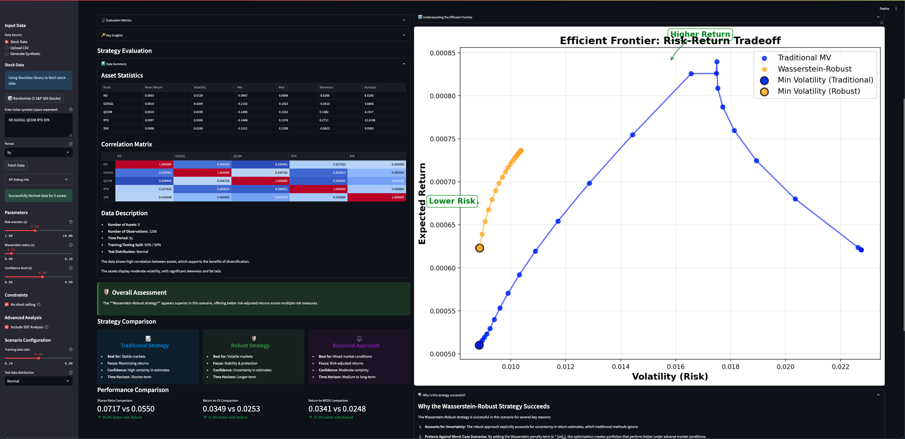

# Wasserstein-Robust Portfolio Optimization

A Streamlit application for comparing traditional Mean-Variance portfolio optimization with Wasserstein-Robust optimization strategies, enhanced with Stochastic Discount Factor (SDF) analysis.



## Features

- **Multiple Data Sources**:
  - Fetch real stock data using the StockDex library
  - Upload your own returns data via CSV
  - Generate synthetic market data for testing

- **Randomize Feature**:
  - Quickly test with 5 random S&P 500 stocks

- **Interactive Parameters**:
  - Adjust risk aversion, robustness, and confidence levels
  - Toggle short selling constraints
  - Configure training/testing scenarios
  - Enable/disable advanced SDF analysis

- **Comprehensive Analysis**:
  - Portfolio weights visualization
  - Performance metrics comparison
  - Efficient frontier visualization
  - Strategy evaluation and recommendations
  - Asset statistics and correlation matrix
  - SDF and WEDS risk measures

- **Educational Content**:
  - Explanations of portfolio optimization concepts
  - Interpretation guides for the efficient frontier
  - Performance metrics explanations
  - Detailed explanation of why strategies succeed
  - Mathematical intuition behind robust optimization

- **User-Friendly Interface**:
  - Expandable sections for cleaner presentation
  - Visual strategy comparison with icons and color coding
  - Interactive metrics with percentage comparisons
  - Automatic data description with key characteristics

## Recent Enhancements

### UI Improvements
- **Expandable Sections**: Converted several sections into expandable containers to make the interface cleaner
- **Visual Strategy Evaluation**: Enhanced with color-coded recommendation boxes and strategy icons
- **Interactive Metrics**: Added visual comparison metrics with percentage differences

### Data Analysis Enhancements
- **Data Summary Section**: Added asset statistics and correlation matrix with heat map visualization
- **Automatic Data Description**: Highlights key characteristics like correlation levels and volatility
- **Improved Test Data Handling**: Clear explanation of data splitting process and distribution options

### Advanced Risk Assessment
- **Stochastic Discount Factor (SDF)**: Implemented SDF estimation for more comprehensive risk analysis
- **Wasserstein Expected Discounted Shortfall (WEDS)**: Added as an advanced risk measure
- **SDF Visualizations**: Added visualizations for SDF over time, return distributions, and risk measure comparisons

### Educational Improvements
- **Strategy Success Explanation**: Added detailed explanation of why the Wasserstein-Robust strategy succeeds
- **Mathematical Intuition**: Included the mathematical foundations behind the regularization approach
- **Enhanced Efficient Frontier Explanation**: Detailed what the curves represent and the significance of key points

## Installation

1. Clone the repository:
   ```bash
   git clone https://github.com/chuckjewell/Wasserstein-Robust-Portfolio-Optimization.git
   cd Wasserstein-Robust-Portfolio-Optimization
   ```

2. Create a virtual environment and install dependencies:
   ```bash
   python -m venv venv
   source venv/bin/activate  # On Windows: venv\Scripts\activate
   pip install -r requirements.txt
   ```

3. Or use the provided launch script:
   ```bash
   chmod +x launch_portfolio_app.sh
   ./launch_portfolio_app.sh
   ```

## Usage

1. Run the application:
   ```bash
   streamlit run app_stockdex.py
   ```

2. Select a data source:
   - **Stock Data**: Enter ticker symbols (e.g., "SPY QQQ DIA") or use the randomize button
   - **Upload CSV**: Upload a CSV file with returns data
   - **Generate Synthetic**: Create simulated market data

3. Adjust parameters:
   - **Risk aversion (γ)**: Controls the trade-off between risk and return
   - **Wasserstein radius (ε)**: Controls the level of robustness
   - **Confidence level (α)**: Used for Expected Shortfall calculation
   - **Include SDF Analysis**: Enable advanced risk assessment with SDF

4. Analyze results:
   - Explore the data summary with asset statistics and correlations
   - Compare portfolio weights and performance metrics
   - Study the efficient frontier and SDF analysis
   - Review the strategy evaluation and recommendations

## Dependencies

- streamlit
- numpy
- pandas
- matplotlib
- scipy
- stockdex
- cvxpy (for optimization)

## License

This project is licensed under the MIT License - see the LICENSE file for details.

## Acknowledgments

- Based on research in robust portfolio optimization using Wasserstein distance
- Utilizes the StockDex library for fetching financial data
- Incorporates Stochastic Discount Factor (SDF) concepts from asset pricing theory